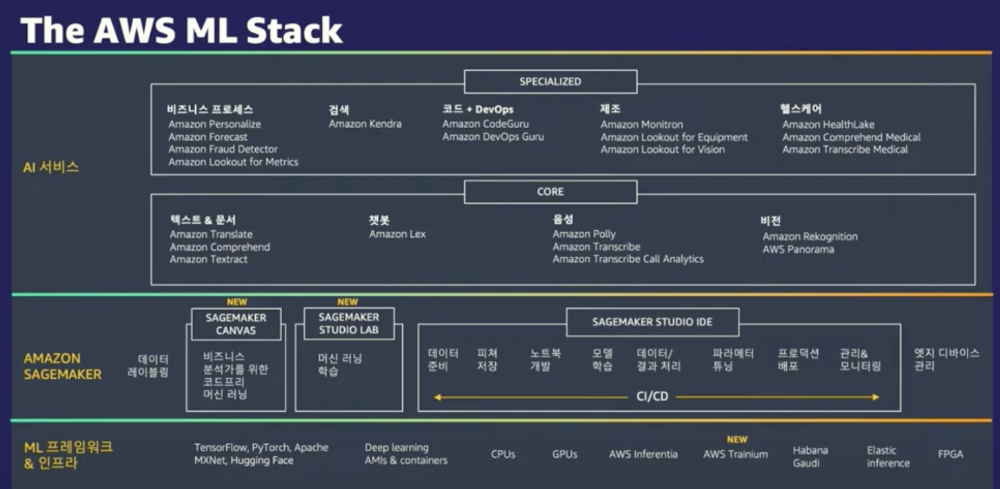
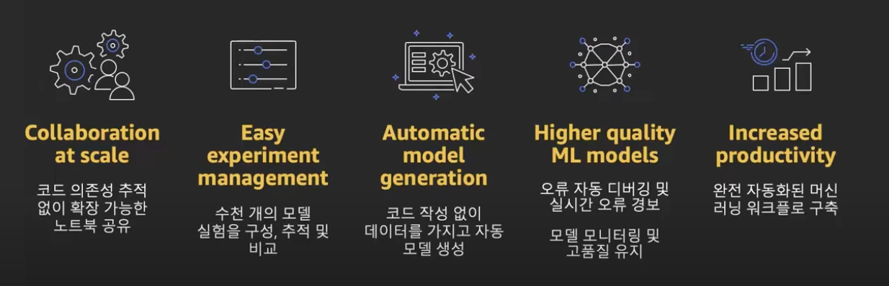
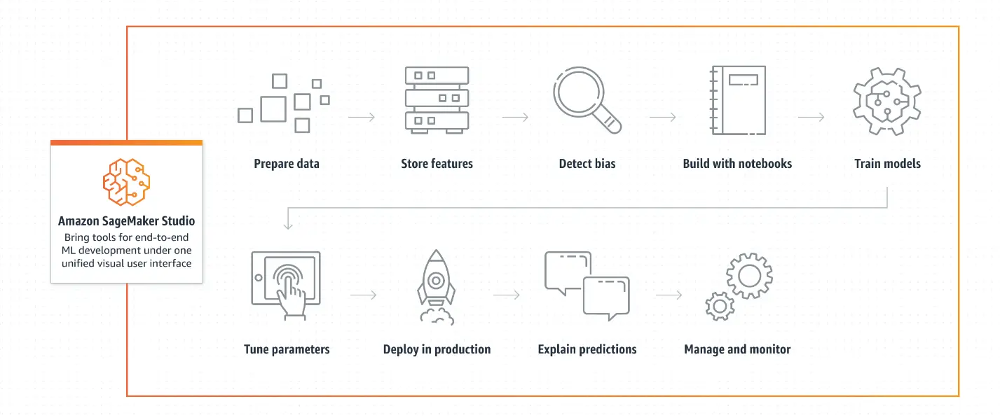
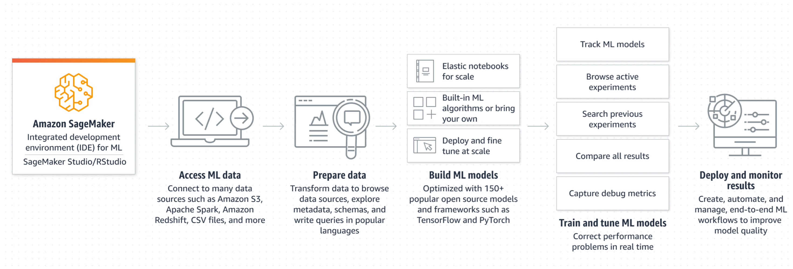
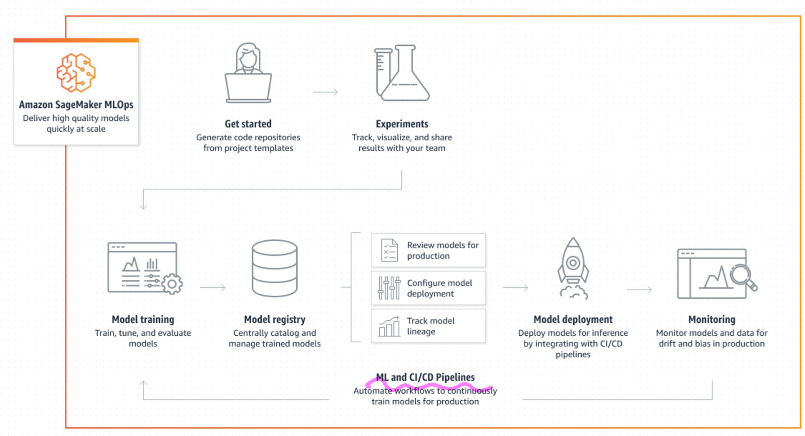

## SageMaker란?

- 완전 관리형 기계 학습 (ML) 서비스
- ML 모델의 개발, 훈련, 배포를 단순화 하고 자동화하는 도구를 제공
  

## SageMaker Studio

머신러닝 모델을 쉽게 빌드, 훈련, 디버깅, 배포 및 모니터링 할 수 있게 해주는 머신러닝을 위한 웹 기반의 통합 개발 환경(IDE)

## SageMaker for Data Scientist, Data Engineer

## SageMaker for MLOps, ML Engineer

## SageMaker의 제공 기능

- 데이터 준비: 데이터 수집, 데이터 탐색 및 분석, Feature Engineering
- 빌드, 학습 및 배포: 머신러닝 모델을 빌드, 학습 및 배포할 수 있는 다양한 도구를 제공. SageMaker Notebook을 사용하여 모델 학습을 위한 커스텀 환경을 구축하거나, SageMaker Training을 사용하여 분산 학습을 실행
- 자동화된 MLOps: 자동화하기 위한 다양한 기능을 제공. SageMaker Pipelines를 사용하여 자동화된 모델 빌드, 학습 및 배포 파이프라인을 생성. SageMaker Model Monitor를 사용하여 모델의 성능과 예측을 모니터링. SageMaker Debugger를 사용하여 모델 디버깅을 자동화하고, SageMaker Experiments를 사용하여 모델 실험을 관리
- 강력한 보안 및 규정 준수: 머신러닝 모델에 대한 강력한 보안 기능을 제공. 데이터 암호화, 모델 암호화, 모델 릴리즈 승인 프로세스, 모델 로깅 및 감시 추적 기능 등을 제공

## Amazon SageMaker 실습

- 환경 설정(Set UP)
- Data Labeling, Feature Engineering
- Model Training
- Hyper-parameter Tuning
- ML Pipeline
- ML Deployment
- Model Monitoring (Clarify fairness and Explainability)
